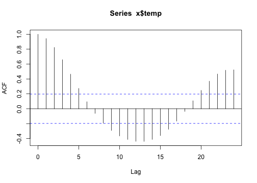
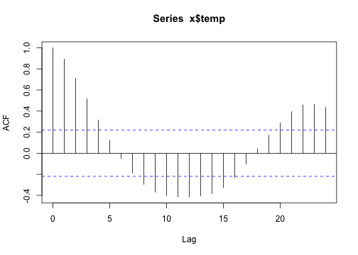
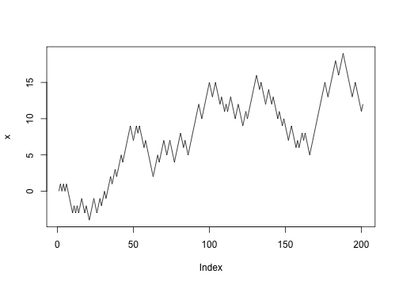
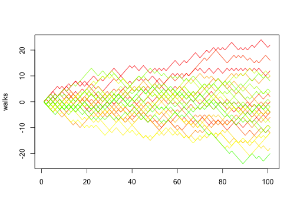
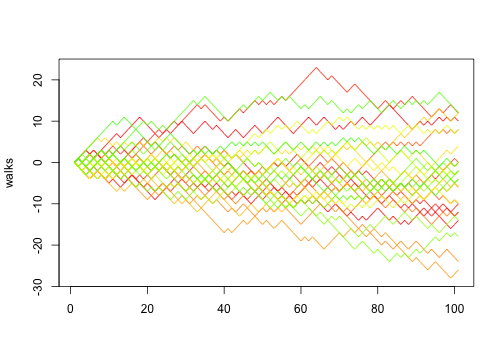

Previously we looked at how you can [use functions to simplify your
code](../functions/). Ideally you have a function that performs a single
operation, and now you want to use it many times to do the same operation on
lots of different data. The naive way to do that would be something like this:


```r
  res1 <-  f(input1)
  res2 <-  f(input2)
  ...
  res10 <-  f(input10)
```


But this isn't very *nice*. Yes, by using a function, you have reduced
a substantial amount of repetition. That **is** nice. But there is
still repetition.  Repeating yourself will cost you time, both now and
later, and potentially introduce some nasty bugs. When it comes to
repetition, well, just don't.

The nice way of repeating elements of code is to use a loop of some
sort. A loop is a coding structure that reruns the same bit of code
over and over, but with only small fragments differing between
runs. In R there is a whole family of looping functions, each with
their own strengths.

# The split--apply--combine pattern

First, it is good to recognise that most operations that involve
looping are instances of the *split-apply-combine* strategy (this term
and idea comes from the prolific [Hadley Wickham](http://had.co.nz/),
who coined the term in [this
paper](http://vita.had.co.nz/papers/plyr.html)).  You start with a
bunch of data.  Then you then **Split** it up into many smaller
datasets, **Apply** a function to each piece, and finally **Combine**
the results back together.

Some data arrives already in its pieces - e.g. output files from from
a leaf scanner or temperature machine. Your job is then to analyse
each bit, and put them together into a larger data set.

Sometimes the combine phase means making a new data frame, other times it might
mean something more abstract, like combining a bunch of plots in a report.

Either way, the challenge for you is to identify the pieces that remain the same
between different runs of your function, then structure your analysis around
that.

# Why we're not starting with `for` loops

Ok, you got me, we are starting with for loops. But not in the way you think.

When you mention looping, many people immediately reach for `for`. Perhaps
that's because, like me, they are already familiar with these other languages,
like basic, python, perl, C, C++ or matlab. While `for` is definitely the most
flexible of the looping options, we suggest you avoid it wherever you can, for
the following two reasons:

1. It is not very expressive, i.e. takes a lot of code to do what you want.
2. It permits you to write horrible code, like this example from my earlier
   work:


```r
  for(n in 1:n.spp)
    {
    Ind = unique(Raw[Raw$SPP==as.character(sp.list$SPP[n]), "INDIV"]);
    I =    length(Ind);
    par(mfrow=c(I,1), oma=c(5,5,5, 2), mar=c(3, 0, 0, 0));
    for(i in 1:I)
        {
        Dat = subset(Raw, Raw$SPP==as.character(sp.list$SPP[n]) & Raw$INDIV==Ind[i])
        Y_ax =seq(0, 35, 10); Y_ax2=seq(0, 35, 5);
        X_ax =seq(0, max(Dat$LL), 0.2); X_ax2 =seq(0, max(Dat$LL), 0.1);
        plot(1:2, 1:2, type="n",log="", axes=F,ann=F, xlim = c(-0.05, max(Dat$LL)+0.05), ylim=c(min(Y_ax), max(Y_ax)), xaxs="i", yaxs="i", las=1)
        axis(2, at=Y_ax, labels=Y_ax, las=1, tck=0.030, cex.axis=0.8, adj = 0.5)
        axis(4, at=Y_ax, labels=F,  tck=0.03)

        X<-Dat$AGE;  Xout<-data.frame(X = c(0,Dat$LL[1]))

        Y<-Dat$S2AV_L;
        points(X,Y,type="p", pch=Fig$Symb[2], cex=1.3, col= Fig$Cols[2]);
        R<-lm( Y~ X); points(Xout$X, predict(R, Xout), type="l", col= Fig$Cols[2], lty = "dotted")

        legend("topright", legend = paste("indiv = ",Ind[i]), bty= "n")
       }
   mtext(expression(paste("Intercepted light (mol ", m^{-2},d^{-1},")")), side = 2, line = 3, outer = T, adj = 0.5, cex =1.2)
   mtext(expression(paste("Leaf age (yrs)")), side = 1, line = 0.2, outer = T, adj = 0.5, cex =1.2)
   mtext(as.character(sp.list$Species[n]), side = 3, line = 2, outer = T, adj = 0.5, cex =1.5)
   }
rm(R, Ind, I, i, X, X_ax, X_ax2, Y_ax, Y_ax2, Y, Xout, Dat)
```


The main problems with this code are that

- it is hard to read
- all the variables are stored in the global scope, which is dangerous.

All it's doing is making a plot! Compare that to something like this


```r
  lapply(unique(Raw$SPP), makePlot, data = Raw)
```

That's much nicer! It's obvious what the loop does, and no new variables are
created. Of course, for the code to work, we need to define the function


```r
makePlot <- function(species, data){
  ... #do stuff
}
```


which actually makes our plot, but having all that detail off in a
function has many benefits. Most of all it makes your code more
reliable and easier to read.  Of course you *could* do this easily
with for loops too:


```r
for (i in unique(Raw$SPP))
  makePlot(i, data = Raw)
```


but the temptation with `for` loops is often to cram a little extra
code in each iteration, rather than stepping back and thinking about
what you're trying to achieve.  

So our reason for avoiding `for` loops, and the similar functions
`while` and `repeat`, is that the other looping functions, like
`lapply`, demand that you write nicer code, so that's we'll focus on
first.

# The apply family

There are several related function in R which allow you to apply some function
to a series of objects (eg. vectors, matrices, dataframes or files). They include:

- `lapply`
- `sapply`
- `tapply`
- `aggregate`
- `mapply`
- `apply`.

Each repeats a function or operation on a series of elements, but they
differ in the data types they accept and return. What they all in
common is that **order of iteration is not important**.  This is
crucial. If each each iteration is independent, then you can cycle
through them in whatever order you like. Generally, we argue that you
should only use the generic looping functions `for`, `while`, and
`repeat` when the order or operations **is** important. Otherwise
reach for one of the apply tools.

# lapply and sapply

`lapply` applies a function to each element of a list (or vector),
collecting results in a list.  `sapply` does the same, but will try to
*simplify* the output if possible.

Lists are a very powerful and flexible data structure that few people seem to
know about. Moreover, they are the building block for other data structures,
like `data.frame` and `matrix`. To access elements of a list, you use the
double square bracket, for example `X[[4]]` returns the fourth element of the
list `X`. If you don't know what a list is, we suggest you [read more
about them](http://cran.r-project.org/doc/manuals/R-intro.html#Lists-and-
data-frames), before you proceed.

## Basic syntax


```r
result <- lapply(X, f, ...)
```


Here `X` is a list or vector, containing the elements that form the input to the
function `f`. This code will also return a list, stored in `result`, with same
number of elements as `X`.

## Usage

lapply is great for building analysis pipelines, where you want to repeat a
series of steps on a large number of similar objects.  The way to do this is to
have a series of lapply statements, with the output of one providing the input to
another:


```r
first.step <- lapply(X, first.function)
second.step <- lapply(first.step, next.function)
```


The challenge is to identify the parts of your analysis that stay the same and
those that differ for each call of the function. The trick to using `lapply` is
to recognise that only one item can differ between different function calls.

It is possible to pass in a bunch of additional arguments to your function, but
these must be the same for each call of your function. For example, let's say we
have a function `test` which takes the path of a file, loads the data, and tests
it against some hypothesised value H0. We can run the function on the file
"myfile.csv" as follows.


```r
result <- test("myfile.csv", H0=1)
```


We could then run the test on a bunch of files using lapply:

```r
files <- c("myfile1.csv", "myfile2.csv", "myfile3.csv")
result <- lapply(files, test, H0=1)
```


But notice, that in this example, the **only this that differs** between the runs
is a single number in the file name. So we could save ourselves typing these by
adding an extra step to generate the file names


```r
files <- lapply(1:10, function(x){paste0("myfile", x, ".csv")})
result <- lapply(files, test, H0=1)
```


The nice things about that piece of code is that it would extend as long as we
wanted, to 10000000 files, if needed.

## Example - plotting temperature for many sites using open weather data

Let's look at the weather in some eastern Australian cities over the
last couple of days.  The website
[openweathermap.com](http://openweathermap.org) provides access to all
sorts of neat data, lots of it essentially real time.  We've parcelled
up some on the nicercode website to use.  In theory, this sort of
analysis script could use the weather data directly, but we don't want
to hammer their website too badly.  The code used to generate these
files is [here](https://gist.github.com/richfitz/5795029).

We want to look at the temperatures over the last few days for the cities


```r
cities <- c("Melbourne", "Sydney", "Brisbane", "Cairns")
```


The data are stored in a url scheme where the Sydney data is at
[http://nicercode.github.io/guides/repeating-things/data/Sydney.csv](http://nicercode.github.io/guides/repeating-things/data/Sydney.csv)
and so on.  

The URLs that we need are therefore:

```r
urls <-
  sprintf("http://nicercode.github.io/guides/repeating-things/data/%s.csv",
          cities)
urls
```

```plain
[1] "http://nicercode.github.io/guides/repeating-things/data/Melbourne.csv"
[2] "http://nicercode.github.io/guides/repeating-things/data/Sydney.csv"   
[3] "http://nicercode.github.io/guides/repeating-things/data/Brisbane.csv" 
[4] "http://nicercode.github.io/guides/repeating-things/data/Cairns.csv"   
```


We can write a function to download a file if it does not exist:


```r
download.maybe <- function(url, refetch=FALSE, path=".") {
  dest <- file.path(path, basename(url))
  if (refetch || !file.exists(dest))
    download.file(url, dest)
  dest
}
```


and then run that over the urls:


```r
path <- "data"
dir.create(path, showWarnings=FALSE)
files <- sapply(urls, download.maybe, path=path)
names(files) <- cities
```


Notice that we never specify the order of which file is downloaded in
which order; we just say "apply this function (`download.maybe`) to
this list of urls.  We also pass the `path` argument to every function
call.  So it was as if we'd written


```r
download.maybe(urls[[1]], path=path)
download.maybe(urls[[2]], path=path)
download.maybe(urls[[3]], path=path)
download.maybe(urls[[4]], path=path)
```


but much less boring, and scalable to more files.

The first column, `time` of each file is a string representing date
and time, which needs processing into R's native time format (dealing
with times in R (or frankly, in any language) is a complete pain).  In
a real case, there might be many steps involved in processing each
file.  We can make a function like this:


```r
load.file <- function(filename) {
  d <- read.csv(filename, stringsAsFactors=FALSE)
  d$time <- as.POSIXlt(d$time)
  d
}
```


that reads in a file given a filename, and then apply that function to
each filename using `lapply`:


```r
data <- lapply(files, load.file)
names(data) <- cities
```


We now have a **list**, where each element is a `data.frame` of
weather data:


```r
head(data$Sydney)
```

```plain
                 time  temp temp.min temp.max
1 2013-06-13 23:00:00 12.66     8.89    16.11
2 2013-06-14 00:00:00 15.90    12.22    20.00
3 2013-06-14 02:00:00 18.44    16.11    20.00
4 2013-06-14 03:00:00 18.68    16.67    20.56
5 2013-06-14 04:00:00 19.41    17.78    22.22
6 2013-06-14 05:00:00 19.10    17.78    22.22
```


We can use `lapply` or `sapply` to easy ask the same question to each
element of this list.  For example, how many rows of data are there?


```r
sapply(data, nrow)
```

```plain
Melbourne    Sydney  Brisbane    Cairns 
       97        99        99        80 
```


What is the hottest temperature recorded by city?

```r
sapply(data, function(x) max(x$temp))
```

```plain
Melbourne    Sydney  Brisbane    Cairns 
    12.85     19.41     22.00     31.67 
```


or, estimate the autocorrelation function for each set:


```r
autocor <- lapply(data, function(x) acf(x$temp, lag.max=24))
```

   

```r
plot(autocor$Sydney, main="Sydney")
```


```r
plot(autocor$Cairns, main="Cairns")
```


I find that for loops can be easier to plot data, partly because
there is nothing to *collect* (or combine) at each iteration.


```r
xlim <- range(sapply(data, function(x) range(x$time)))
ylim <- range(sapply(data, function(x) range(x[-1])))
plot(data[[1]]$time, data[[1]]$temp, ylim=ylim, type="n",
     xlab="Time", ylab="Temperature")
cols <- 1:4
for (i in seq_along(data))
  lines(data[[i]]$time, data[[i]]$temp, col=cols[i])
```


```r
plot(data[[1]]$time, data[[1]]$temp, ylim=ylim, type="n",
     xlab="Time", ylab="Temperature")
mapply(function(x, col) lines(x$time, x$temp, col=col),
       data, cols)
```


```plain
$Melbourne
NULL

$Sydney
NULL

$Brisbane
NULL

$Cairns
NULL
```


### Parallelising your code

Another great feature of lapply is that is **makes it really easy to parallelise
your code**. All computers now contain multiple CPUs, and these can all be put to
work using the great [multicore package](http://www.rforge.net/multicore/).


```r
result <- lapply(x, f)   #apply f to x using a single core and lapply

library(multicore)
result <- mclapply(x, f) #same thing using all the cores in your machine
```


# tapply and aggregate

In the case above, we had naturally "split" data; we had a vector of
city names that led to a list of different data.frames of weather
data.  Sometimes the "split" operation depends on a factor.  For
example, you might have an experiment where you measured the size of
plants at different levels of added fertiliser - you then want to know
the mean height as a function of this treatment.

However, we're actiually going to use some data on [ratings of seinfeld episodes](https://github.com/audy/smalldata), taken from the [Internet movie Database]
(http://www.reddit.com/r/dataisbeautiful/comments/1g7jw2/seinfeld_imdb_episode_ratings_oc/).


```r
library(downloader)
if (!file.exists("seinfeld.csv"))
  download("https://raw.github.com/audy/smalldata/master/seinfeld.csv",
           "seinfeld.csv")
dat <- read.csv("seinfeld.csv", stringsAsFactors=FALSE)
```

Columns are Season (number), Episode (number), Title (of the
episode), Rating (according to IMDb) and Votes (to construct the
rating).


```r
head(dat)
```

```plain
  Season Episode             Title Rating Votes
1      1       2      The Stakeout    7.8   649
2      1       3       The Robbery    7.7   565
3      1       4    Male Unbonding    7.6   561
4      1       5     The Stock Tip    7.8   541
5      2       1 The Ex-Girlfriend    7.7   529
6      2       1        The Statue    8.1   509
```


Make sure it's sorted sensibly

```r
dat <- dat[order(dat$Season, dat$Episode),]
```


Biologically, this could be Site / Individual / ID / Mean size /
Things measured.

Hypothesis: Seinfeld used to be funny, but got progressively less
good as it became too mainstream.  Or, does the mean episode rating
per season decrease?

Now, we want to calculate the average rating per season:

```r
mean(dat$Rating[dat$Season == 1])
```

```plain
[1] 7.725
```

```r
mean(dat$Rating[dat$Season == 2])
```

```plain
[1] 8.158
```

and so on until:

```r
mean(dat$Rating[dat$Season == 9])
```

```plain
[1] 8.323
```


As with most things, we *could* automate this with a for loop:


```r
seasons <- sort(unique(dat$Season))
rating  <- numeric(length(seasons))
for (i in seq_along(seasons))
  rating[i] <- mean(dat$Rating[dat$Season == seasons[i]])
```


That's actually not that horrible to do.  But we it could be
nicer.  We first **split** the ratings by season:

```r
ratings.split <- split(dat$Rating, dat$Season)
head(ratings.split)
```

```plain
$`1`
[1] 7.8 7.7 7.6 7.8

$`2`
 [1] 7.7 8.1 8.0 7.9 7.8 8.5 8.7 8.5 8.0 8.0 8.4 8.3

$`3`
 [1] 8.3 7.5 7.8 8.1 8.3 7.3 8.7 8.5 8.5 8.6 8.1 8.4 8.5 8.7 8.6 7.8 8.3
[18] 8.6 8.7 8.6 8.0 8.5 8.6

$`4`
 [1] 8.4 8.3 8.6 8.5 8.7 8.6 8.1 8.2 8.7 8.4 8.3 8.7 8.5 8.6 8.3 8.2 8.4
[18] 8.5 8.4 8.7 8.7 8.4 8.5

$`5`
 [1] 8.6 8.4 8.4 8.4 8.3 8.2 8.1 8.5 8.5 8.3 8.0 8.1 8.6 8.3 8.4 8.5 7.9
[18] 8.0 8.5 8.7 8.5

$`6`
 [1] 8.1 8.4 8.3 8.4 8.2 8.3 8.5 8.4 8.3 8.2 8.1 8.4 8.6 8.2 7.5 8.4 8.2
[18] 8.5 8.3 8.4 8.1 8.5 8.2
```


Then use sapply to loop over this list, computing the mean

```r
rating <- sapply(ratings.split, mean)
```


Then if we wanted to apply a different function (say, compute the
per-season standard error) we could just do:

```r
se <- function(x)
  sqrt(var(x) / length(x))
rating.se <- sapply(ratings.split, se)

plot(rating ~ seasons, ylim=c(7, 9), pch=19)
arrows(seasons, rating - rating.se, seasons, rating + rating.se,
       code=3, angle=90, length=0.02)
```


But there's still repetition there.  Let's abstract that away a bit.

Suppose we want a:
  1. response variable (like Rating was)
  2. grouping variable (like Season was)
  3. function to apply to each level

This just writes out *exactly* what we had before

```r
summarise.by.group <- function(response, group, func) {
  response.split <- split(response, group)
  sapply(response.split, func)
}
```


We can compute the mean rating by season again:

```r
rating.new <- summarise.by.group(dat$Rating, dat$Season, mean)
```


which is the same as what we got before:

```r
identical(rating.new, rating)
```

```plain
[1] TRUE
```


Of course, we're not the first people to try this.  This is **exactly**
what the `tapply` function does (but with a few bells and whistles,
especially around missing values, factor levels, additional
arguments and multiple grouping factors at once).

```r
tapply(dat$Rating, dat$Season, mean)
```

```plain
    1     2     3     4     5     6     7     8     9 
7.725 8.158 8.304 8.465 8.343 8.283 8.441 8.423 8.323 
```


So using `tapply`, you can do all the above manipulation in a
single line.

There are a couple of limitations of `tapply`.

The first is that getting the season out of `tapply` is quite
hard.  We could do:

```r
as.numeric(names(rating))
```

```plain
[1] 1 2 3 4 5 6 7 8 9
```


But that's quite ugly, not least because it involves the conversion
numeric -> string -> numeric.

Better could be to use

```r
sort(unique(dat$Season))
```

```plain
[1] 1 2 3 4 5 6 7 8 9
```


But that requires knowing what is going on inside of `tapply` (that
unique levels are sorted and data are returned in that order).

I suspect that this approach:

```r
first <- function(x) x[[1]]
tapply(dat$Season, dat$Season, first)
```

```plain
1 2 3 4 5 6 7 8 9 
1 2 3 4 5 6 7 8 9 
```

is probably the most fool-proof, but it's certainly not pretty.

However, the returned format is extremely flexible.  If you do:


The `aggregate` function provides a simplfied interface to `tapply`
that avoids this issue.  It has two interfaces: the first is
similar to what we used before, but the grouping variable now must
be a list or data frame:

```r
aggregate(dat$Rating, dat["Season"], mean)
```

```plain
  Season     x
1      1 7.725
2      2 8.158
3      3 8.304
4      4 8.465
5      5 8.343
6      6 8.283
7      7 8.441
8      8 8.423
9      9 8.323
```


(note that `dat["Season"]` returns a one-column data frame).  The
column 'x' is our response variable, Rating, grouped by season.  We
can get its name included in the column names here by specifying
the first argument as a `data.frame` too:

```r
aggregate(dat["Rating"], dat["Season"], mean)
```

```plain
  Season Rating
1      1  7.725
2      2  8.158
3      3  8.304
4      4  8.465
5      5  8.343
6      6  8.283
7      7  8.441
8      8  8.423
9      9  8.323
```


The other interface is the formula interface, that will be familiar
from fitting linear models:

```r
aggregate(Rating ~ Season, dat, mean)
```

```plain
  Season Rating
1      1  7.725
2      2  8.158
3      3  8.304
4      4  8.465
5      5  8.343
6      6  8.283
7      7  8.441
8      8  8.423
9      9  8.323
```


This interface is really nice; we can get the number of votes here
too.

```r
aggregate(cbind(Rating, Votes) ~ Season, dat, mean)
```

```plain
  Season Rating Votes
1      1  7.725 579.0
2      2  8.158 533.0
3      3  8.304 496.7
4      4  8.465 497.0
5      5  8.343 452.5
6      6  8.283 385.7
7      7  8.441 408.0
8      8  8.423 391.4
9      9  8.323 415.0
```


If you have multiple grouping variables, you can write things like:
```
aggregate(response ~ factor1 + factor2, dat, function)
```

to apply a function to each pair of levels of `factor1` and `factor2`.

# replicate

This is great in Monte Carlo simulation situations.  For example.
Suppose that you flip a fair coin n times and count the number of
heads:


```r
trial <- function(n)
  sum(runif(n) < 0.5) # could have done a binomial draw...
```


You can run the trial a bunch of times:

```r
trial(10)
```

```plain
[1] 4
```

```r
trial(10)
```

```plain
[1] 4
```

```r
trial(10)
```

```plain
[1] 6
```


and get a feel for the results.  If you want to replicate the trial
100 times and look at the distribution of results, you could do:

```r
replicate(100, trial(10))
```

```plain
  [1] 4 4 5 6 8 5 5 7 3 5 6 4 4 3 5 3 6 7 2 6 6 4 5 4 4 4 4 5 6 5 4 2 6 5 6
 [36] 5 6 8 5 6 4 5 4 5 5 5 4 7 3 5 5 6 4 6 4 6 4 4 4 6 3 5 5 7 6 7 5 3 4 4
 [71] 5 6 8 5 6 2 5 7 6 3 5 9 3 7 6 4 5 3 7 3 3 7 6 8 5 4 6 7 4 3
```


and then you could plot these:

```r
plot(table(replicate(10000, trial(50))))
```


# for loops

"`for`" loops shine where the output of one iteration depends on
the result of the previous iteration.

Suppose you wanted to model random walk.  Every time step, with 50%
probability move left or right.

Start at position 0

```r
x <- 0
```

Move left or right with probability p (0.5 = unbiased)

```r
p <- 0.5
```


Update the position

```r
x <- x + if (runif(1) < p) -1 else 1
```


Let's abstract the update into a function:

```r
step <- function(x, p=0.5)
  x + if (runif(1) < p) -1 else 1
```


Repeat a bunch of times:

```r
x <- step(x)
x <- step(x)
```


To find out where we got to after 20 steps:

```r
for (i in 1:20)
  x <- step(x)
```


If we want to collect where we're up to at the same time:

```r
nsteps <- 200
x <- numeric(nsteps + 1)
x[1] <- 0 # start at 0
for (i in seq_len(nsteps))
  x[i+1] <- step(x[i])
plot(x, type="l")
```




Pulling *that* into a function:

```r
random.walk <- function(nsteps, x0=0, p=0.5) {
  x <- numeric(nsteps + 1)
  x[1] <- x0
  for (i in seq_len(nsteps))
    x[i+1] <- step(x[i])
  x
}
```


We can then do 30 random walks:

```r
walks <- replicate(30, random.walk(100))
matplot(walks, type="l", lty=1, col=rainbow(nrow(walks)))
```




Of course, in this case, if we think in terms of vectors we can
actually implement random walk using implicit vectorisation:

```r
random.walk <- function(nsteps, x0=0, p=0.5)
  cumsum(c(x0, ifelse(runif(nsteps) < p, -1, 1)))

walks <- replicate(30, random.walk(100))
matplot(walks, type="l", lty=1, col=rainbow(nrow(walks)))
```




Which reinforces one of the advantages of thinking in terms of
functions: you can change the implementation detail without the
rest of the program changing.


